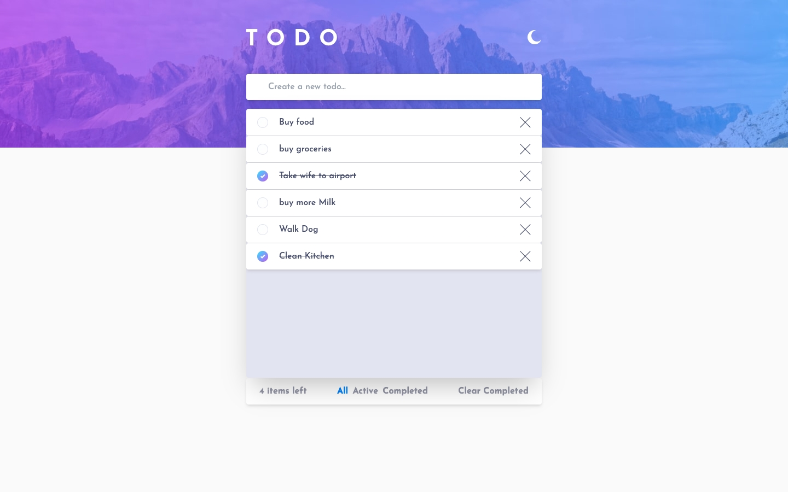
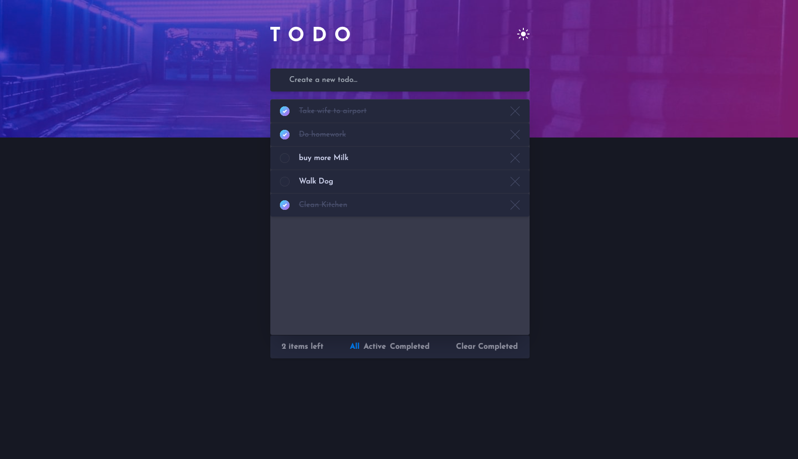

# Frontend Mentor - Todo app solution

This is a solution to the [Todo app challenge on Frontend Mentor](https://www.frontendmentor.io/challenges/todo-app-Su1_KokOW). Frontend Mentor challenges help you improve your coding skills by building realistic projects.

## Table of contents

- [Overview](#overview)
  - [Screenshot](#screenshot)
  - [Links](#links)
  - [Built with](#built-with)
  - [What I learned](#what-i-learned)
  - [Continued development](#continued-development)
  - [Useful resources](#useful-resources)
- [Author](#author)

## Overview

An HTML CSS and Javascript interactive rating component.

### Screenshot

### Links

- Solution URL: https://www.frontendmentor.io/challenges/todo-app-Su1_KokOW/hub?share=true
- Live Site URL: https://todo-app-xi-flame.vercel.app/
- GitHub Repo: https://github.com/rzounlom/todo-app

## My process

### Built with

- NextJs 14
- Typescript
- Tailwind CSS
- Prisma

### What I learned

How to use the Prisma ORM for MongoDB to create a full-stack NextJS app

### Continued development

Will work on a cleaner folder structure and testing in my next project

### Useful resources

- https://fonts.google.com/specimen/Josefin+Sans - Google Josefin Sans url
- https://vercel.com/ - Vercel for deploying my app
- https://tailwindcss.com/docs - Tailwind CSS docs
- https://nextjs.org/ - NextJS Docs
- https://www.prisma.io/ - Prisma Docs

## Author

- Frontend Mentor - https://www.frontendmentor.io/profile/@rzounlom
- GitHub - https://github.com/rzounlom

## Running this app locall

- Download the repo and install all dependencies --> npm install, npm i, yarn, or yarn install
- Create a make sure you create a .env file and add a valid mogo database url. You can find the instructions on the Prisma website --> https://www.prisma.io/docs/getting-started/setup-prisma/add-to-existing-project/mongodb/connect-your-database-typescript-mongodb
- run the server - npm run dev, or yarn dev
